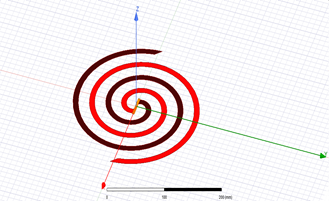

# Antenna-Design-in-HFSS

Spiral antenna is a frequency independent antenna which can be printed in a flexible substrate. 
The lower and higher frequency band is limited by the inner and outer radius of the antenna. 
In this project, a 55 MHz-700 MHz range broadband antenna is designed with HFSS. 
Then, S11, VSWR, gain and directivity of this antenna is measured and the designed is optimized. 
The analysis shows that shrinking the antenna size creates a lot of fluctuation in S11 and VSWR plot and at some smaller size, antenna becomes totally reflective.
Lastly, the performance metrics relation with the antenna parameters are analyzed.   

  
  

